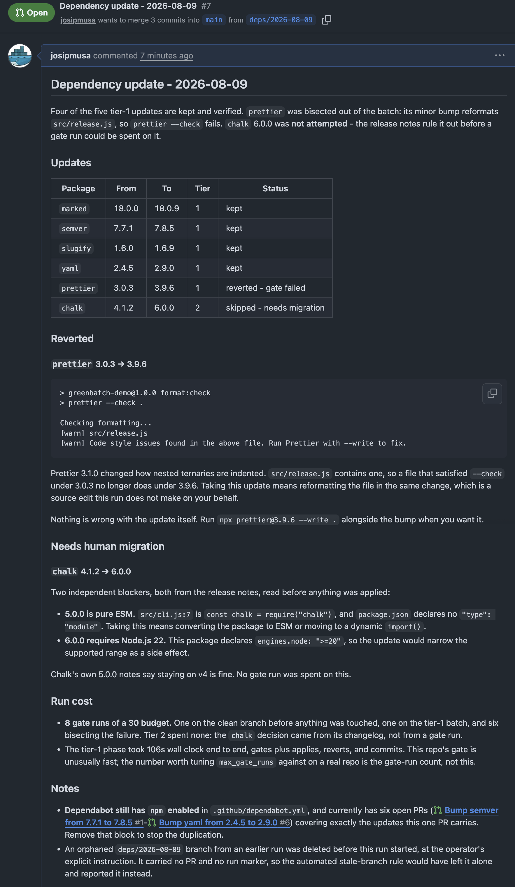
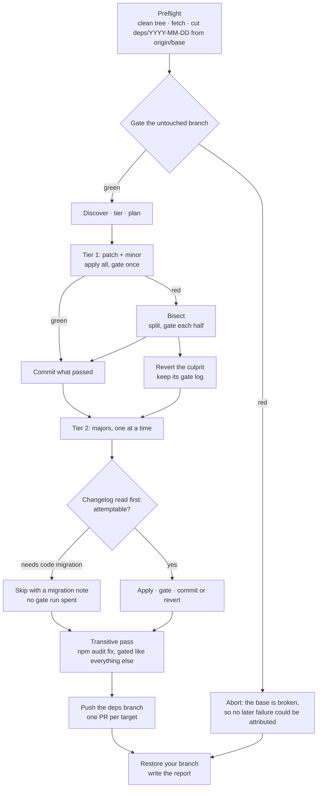

# greenbatch

**One verified dependency branch per run, instead of a PR per package.**

Dependabot opens one PR per update and each one fires a full CI pipeline. Forty pending
updates against a six-minute pipeline is four hours of CI to be told forty times that
the tests still pass - and forty PRs for someone to shepherd.

greenbatch runs the verification once. It discovers every available update, applies them
in risk-tiered batches on a dedicated branch, gates each batch with **your repo's own
build and test command**, bisects failures so only what actually breaks gets reverted,
and opens one PR per target branch with a report of what was kept, what was reverted and
why, and what it deliberately did not touch.

It is a [Claude Code](https://claude.com/claude-code) skill. It runs interactively or
headless on a schedule. It never merges anything.

## A real run

Against a small repository with six out-of-date dependencies and a gate of
`npm ci && prettier --check . && node --test`. Six updates found, four kept, one
reverted, one never attempted.

The tier-1 batch failed, so the run bisected it:

```
gate 1   (untouched branch, nothing applied)          PASS
gate 2   marked, prettier, semver, slugify, yaml      FAIL   the tier-1 batch
gate 3   marked, prettier, semver                     FAIL   split
gate 4   marked, prettier                             FAIL   split
gate 5   marked                                       PASS   kept
gate 6   prettier                                     FAIL   culprit, reverted
gate 7   semver                                       PASS   kept
gate 8   slugify, yaml                                PASS   kept
```

`prettier` 3.1.0 changed how nested ternaries are indented, so the bumped
formatter rejects a file the pinned one had formatted. Four updates ship
verified; the fifth is reported with the gate output that condemned it.

`chalk` 4 → 6 was skipped without spending a gate run at all. Its release notes
say 5.0.0 is pure ESM and 6.0.0 requires Node 22, and this package is CommonJS
declaring `engines.node: ">=20"` - so the PR carries a migration note instead of
a failed attempt.

<details>
<summary><strong>The pull request it opened</strong> - the updates table, the revert with
its gate log, and the migration note it wrote instead of attempting
<code>chalk</code>.</summary>



</details>

Dependabot's answer to the same repository, on the same day, was six separate
pull requests.


## How it is different

|  | Dependabot / Renovate | greenbatch |
|---|---|---|
| PRs per run | one per package or group | one per target branch |
| CI cost | one pipeline per PR | one pipeline, on a pre-verified branch |
| Verification before the PR | none - CI finds out | your own gate, locally, per batch |
| A batch fails | the whole group PR is red | bisected; only the culprit is reverted |
| Majors | opens the PR, you read the changelog | changelog read *first*; unattemptable ones are skipped with a written migration note |
| Updates it cannot take | silent | reported: prereleases, BOM-pinned versions, rejected pins |
| Ecosystem coverage | broad | npm and Maven (adapters wanted) |

The last two rows are the ones to weigh. greenbatch covers less ground than Dependabot,
on purpose, and expects you to keep Dependabot for GitHub Actions, Docker, and Terraform.
What it gives back is a single reviewable diff that has already been tested, and a report
that never lets silence read as "everything is current".

## Quickstart

```bash
# 1. Install the plugin
/plugin marketplace add josipmusa/greenbatch
/plugin install greenbatch@greenbatch

# 2. In the repo you want updated - read-only, changes nothing:
/greenbatch plan

# 3. When the plan looks right, on a clean tree:
/greenbatch
```

`/greenbatch plan` discovers, tiers, and reports what a full run *would* do - the
tier-1 batch, the tier-2 order, everything it would deliberately not take, and the gate
budget it would spend. It cuts no branch, applies nothing, and runs no gate, so it is
safe on any repo including a dirty one. It is the honest way to find out whether this
tool is worth a run on your codebase.

The first full run has no config, so it proposes one derived from your
`.github/dependabot.yml`, asks you to confirm the **gate** command, and writes
`.claude/greenbatch.yml` once you approve. After that the run is fully unattended and
can be scheduled - see [docs/headless.md](docs/headless.md).

Requirements: `git`, `node` (for the planner), plus `npm` or `mvn` + `java` + `python3`
depending on your ecosystem. `gh` is optional; without it the run finishes its work and
prints ready-to-paste PR bodies instead of filing them.

## Config

`.claude/greenbatch.yml` is canonical, falling back to `greenbatch.yml` at the repo root
so agents other than Claude Code can drive this. Check yours any time with
`scripts/core/config.mjs .`.

```yaml
branches:
  base: main              # the deps branch is cut from here
  targets: [dev, main]    # branches to open PRs toward
gate: "npm ci && npm run verify"   # must exit 0 for a batch to be kept
ecosystems: auto          # or an explicit list: [npm], [maven], [npm, maven]
groups:                   # cross-ecosystem atomic groups
  react: ["react", "react-dom", "@types/react", "@types/react-dom"]
  vite: ["vite", "@vitejs/*"]
risky: ["react", "vite"]  # always tier 2, even for a patch bump
reject: []                # never touch (intentional pins); supports globs
labels: ["dependencies"]
commit_prefix: "build"
max_gate_runs: 30         # one counter across the whole run
```

Three keys behave in ways the comments above do not give away. Non-base `targets` each
get a derived branch, so the base-bound PR is not polluted with their unreleased commits.
`gate` should include your build step - one that only runs unit tests silently weakens
every claim in the report. And `max_gate_runs` is a budget for the whole run, but tier 1
always completes; tier 2 and the transitive pass spend what is left.

An unknown key is an error naming the line and the key you probably meant, never a silent
fallback to the default - `rejects:` for `reject:` would otherwise mean a package you
deliberately pinned gets updated with nothing in the report about it. Grouping inside an
ecosystem needs no config at all: the npm adapter already treats a shared scope, and a
package with its `@types` stub, as one atomic element.

## How a run goes



Every branch of that diagram ends at the same place: your original branch, restored, with
a report written. Step by step in
[skills/greenbatch/SKILL.md](skills/greenbatch/SKILL.md); the reasoning behind the shape
in [docs/design.md](docs/design.md).

## Headless

Headless means a `claude -p` session with nobody watching - on your workstation, a build
server, or a disposable cloud VM - not a particular CI product. An over-budget plan
proceeds and reports instead of asking, an invalid config aborts rather than being
repaired, and every stop condition writes `.git/greenbatch/report.md`, so a scheduled run
always leaves an artifact.

Invocation, cron and systemd timers, required environment, and report-only mode:
[docs/headless.md](docs/headless.md).

## Safety model

greenbatch **never force-pushes**, and the one script that touches a remote pushes
nothing but the `deps/YYYY-MM-DD` branches it created - never your base or target
branches. It **never deletes a branch it did not create**, **never merges** a PR,
**never edits your source** to make a breaking change fit, and **never runs
`npm audit fix --force`**.
It **aborts on a dirty tree** and on a gate that was already failing before it touched
anything, and it **restores your original branch on every exit path**.

Some of that is enforced by a script that refuses, and the rest is part of the written
procedure the agent follows. The distinction is real, so
[SECURITY.md](SECURITY.md) states which rule is which rather than presenting one
undifferentiated list of "guarantees" - alongside the trust boundaries, including what
running this against a repository means for the code it executes. The scripts are
readable in an afternoon and runnable outside any agent.

## Ecosystems

**Core:** npm, Maven.

Everything ecosystem-specific lives behind a published contract, so adding one is a
self-contained job: four scripts, a manifest, a fixture, and a passing conformance run.
See [docs/adapters.md](docs/adapters.md) and [CONTRIBUTING.md](CONTRIBUTING.md).

Wanted next: **Python (uv/pip), Go, Rust.**

## Known gaps

Stated plainly rather than discovered later:

- **Single-manifest repos only.** No workspace or monorepo support: one `package.json`
  or one `pom.xml` at the root.
- **Multi-module Maven is partially covered.** Discovery scans the root pom only, which
  in the usual layout is where `<properties>` and `<dependencyManagement>` live, so most
  versions are still found and moved. Anything declared in a child module is not, and
  the run says so in the report rather than letting it read as current. Full reactor
  support is the next thing planned for the Maven adapter.
- **npm only, among Node package managers.** pnpm, yarn, and bun projects are declined
  rather than mismanaged; each needs its own adapter.
- **npm and Maven only.** Everything else needs an adapter.
- **GitHub only for PR filing.** Other forges get report-only mode.
- **No notification step**, by design.

## License

MIT. See [LICENSE](LICENSE).
